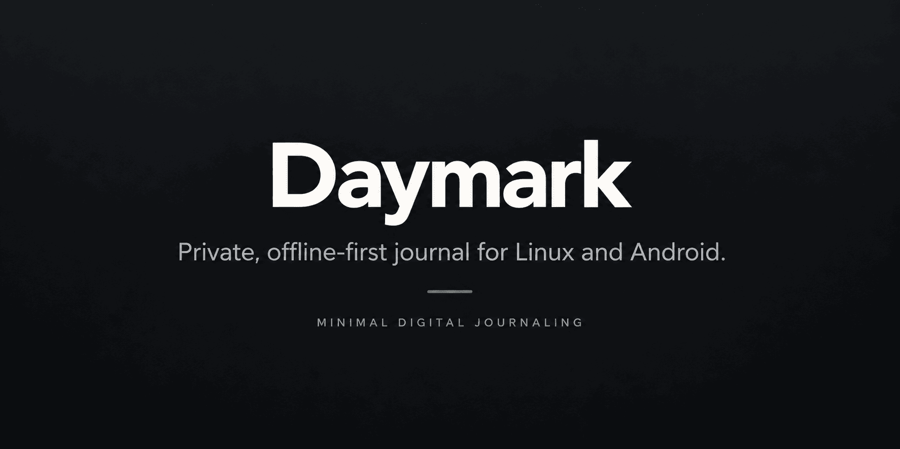

# Daymark

Daymark is a minimal, local-first Bullet Journal application for Linux and Android. It keeps the journal, reflection, and deliberate migration decisions at the center while avoiding the usual digital productivity clutter.

Daymark is offline-first, stores journal data in an encrypted local database, and follows the core Bullet Journal method with a small number of explicit digital adaptations.

## What Daymark includes

- Daily Log with Rapid Logging for Tasks, Events, and Notes
- deliberate Task completion, migration, scheduling, and discard
- Daily and Monthly reflection over unresolved Tasks
- Monthly Log with Calendar, Tasks, and optional finite Trackers
- rolling six-month Future Log with arrival review
- Collections with owned entries and references
- deliberate Index and local read-only Search
- built-in Signifiers for priority, inspiration, and exploration
- encrypted Backup / Restore
- plaintext Open Export to JSON or Markdown
- automatic locking after inactivity and host-system lock events
- responsive Linux and Android interface with System, Light, and Dark appearance
- English, Portuguese (Brazil), and Spanish application localization

## Principles

Daymark is intentionally narrow:

- faithful to the core Bullet Journal method
- digitally minimal
- local-first and offline-first
- encrypted at rest
- explicit about Daymark-specific adaptations
- free of accounts, feeds, advertising, gamification, streaks, productivity scores, and attention-seeking UI

Automation must not remove reflection or deliberate migration decisions from the method.

## Platforms

Daymark currently targets:

- Linux x64, distributed as Debian package and AppImage
- Android

The project uses Flutter and Dart. The exact supported toolchain and dependency set are documented in the developer documentation and lockfile.

## Documentation

- **User guide (Português do Brasil):** [Daymark Wiki](https://github.com/marcelositr/daymark/wiki)
- **Developer documentation:** [`docs/README.md`](docs/README.md)
- **Architecture:** [`docs/ARCHITECTURE.md`](docs/ARCHITECTURE.md)
- **Security:** [`docs/SECURITY.md`](docs/SECURITY.md)
- **Contributing:** [`docs/CONTRIBUTING.md`](docs/CONTRIBUTING.md)
- **AI-assisted development:** [`docs/AI.md`](docs/AI.md)

For development work, including AI-assisted work, start with [`docs/README.md`](docs/README.md).

## Project links

- Website: [devnux.com.br/daymark](https://devnux.com.br/daymark)
- Source: [github.com/marcelositr/daymark](https://github.com/marcelositr/daymark)
- Releases: [GitHub Releases](https://github.com/marcelositr/daymark/releases)
- Issues: [GitHub Issues](https://github.com/marcelositr/daymark/issues)

## License

Daymark is distributed under the GNU General Public License v3.0 or later (`GPL-3.0-or-later`).
